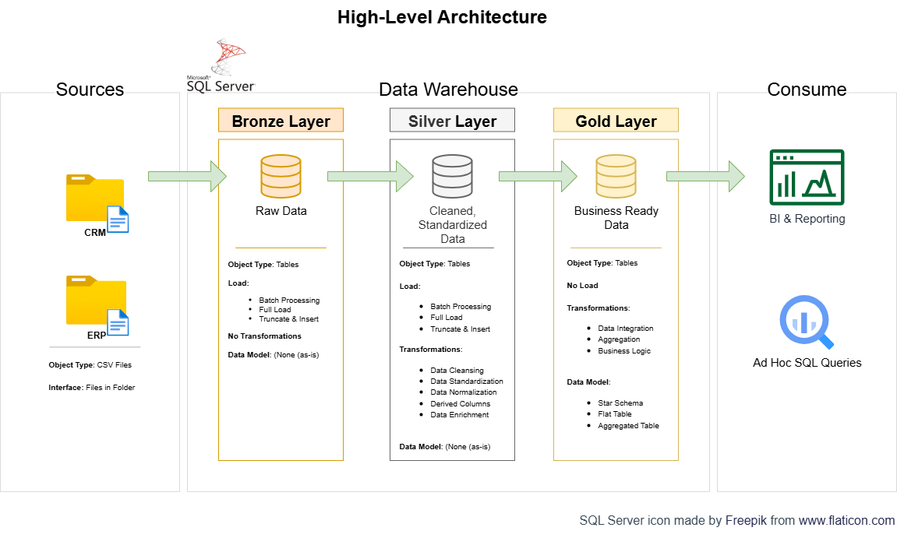

# Data Warehouse and Analytics Project
Welcome to my **Data Warehouse & Analytics Project** repository.

This project serves as a detailed demonstration of a robust data warehousing and analytics solution. It covers the entire lifecycle, from the initial construction of the data warehouse to creating practical, actionable insights, all while upholding industry-standard best practices in data engineering and analytics.

___
## 📖 Project Overview
This project involves:

- **Data Architecture**: Designing a modern data warehouse structure that utilizes the Bronze, Silver, and Gold layers of a medallion architecture.
- **ETL Pipelines**: Extracting, transforming, and loading data from source systems into the warehouse.
- **Data Modeling**: Developing fact and dimension tables optimized for analytical queries.
- **Analytics & Reporting**: Creating SQL-based reports and dashboards for actionable insights.

This repository is an excellent resource for anyone interested in building a free or low-cost data warehouse, proving that powerful data solutions are accessible to everyone, including non-profit organizations.

## 🛠️ Links & Tools:

Everything is for Free!
- **[SQL Server Express](https://www.microsoft.com/en-us/sql-server/sql-server-downloads):** Lightweight server for hosting your SQL database.
- **[SQL Server Management Studio (SSMS)](https://learn.microsoft.com/en-us/sql/ssms/download-sql-server-management-studio-ssms?view=sql-server-ver16):** GUI for managing and interacting with databases.
- **[Git Repository](https://github.com/):** Set up a GitHub account and repository to manage, version, and collaborate on your code efficiently.
- **[DrawIO](https://www.drawio.com/):** Design data architecture, models, flows, and diagrams.
- **[Notion](https://www.notion.com/):** Web-based platform that serves as a versatile workspace for note-taking, project management, and collaboration for your project.

---
### Data Architecture

The data architecture for this project follows Medallion Architecture **Bronze**, **Silver**, and **Gold** layers:

1. **Bronze Layer**: Stores raw data as-is from the source systems. Data is ingested from CSV Files into SQL Server Database.
2. **Silver Layer**: This layer includes data cleansing, standardization, and normalization processes to prepare data for analysis.
3. **Gold Layer**: Houses business-ready data modeled into a star schema required for reporting and analytics.

### Building the Data Warehouse (Data Engineering)
#### Objective
Develop a modern data warehouse using SQL Server to consolidate sales data, enabling analytical reporting and informed decision-making.

#### Specifications
- **Data Sources**: Import data from two source systems (ERP and CRM) provided as CSV files.
- **Data Quality**: Cleanse and resolve data quality issues prior to analysis.
- **Integration**: Combine both sources into a single, user-friendly data model designed for analytical queries.
- **Scope**: Focus on the latest dataset only; historization of data is not required.
- **Documentation**: Provide clear documentation of the data model to support both business stakeholders and analytics teams.

### BI: Analytics & Reporting (Data Analysis)
#### Objective
<<Coming Soon>>
Develop SQL-based analytics to deliver detailed insights into:

- **Customer Behavior**
- **Product Performance**
- **Sales Trends**

These insights empower stakeholders with key business metrics, enabling strategic decision-making.

---
### Links to all Materials

- [Project Plan](https://www.notion.so/SQL-Data-Warehouse-Project-235522df094980738d1debee054da0ee?source=copy_link)
